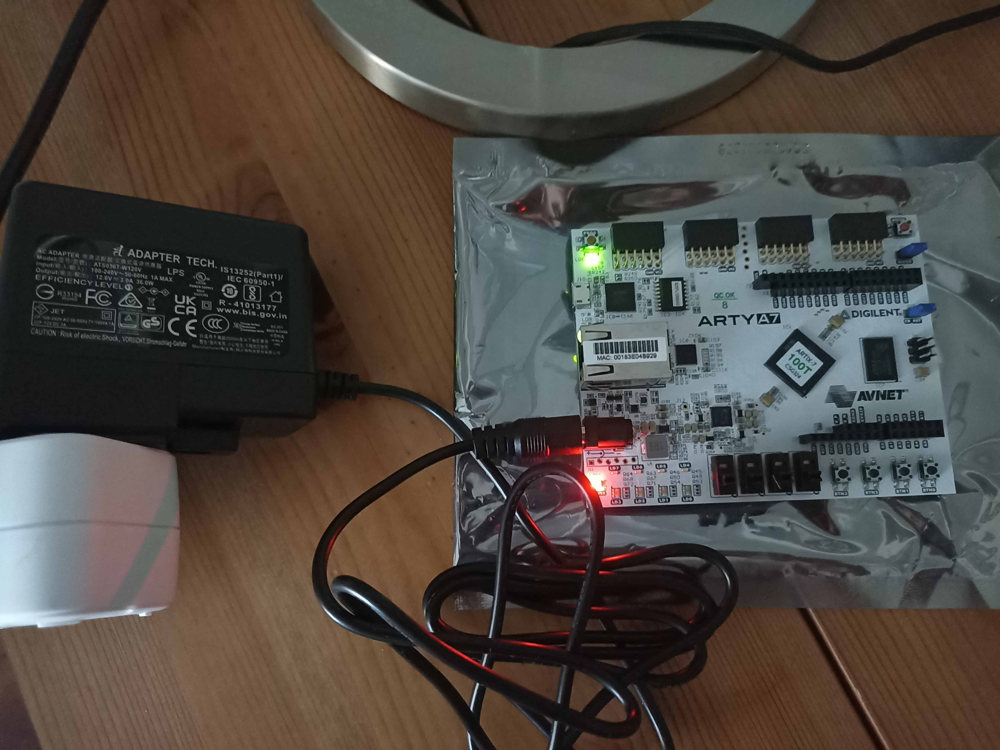
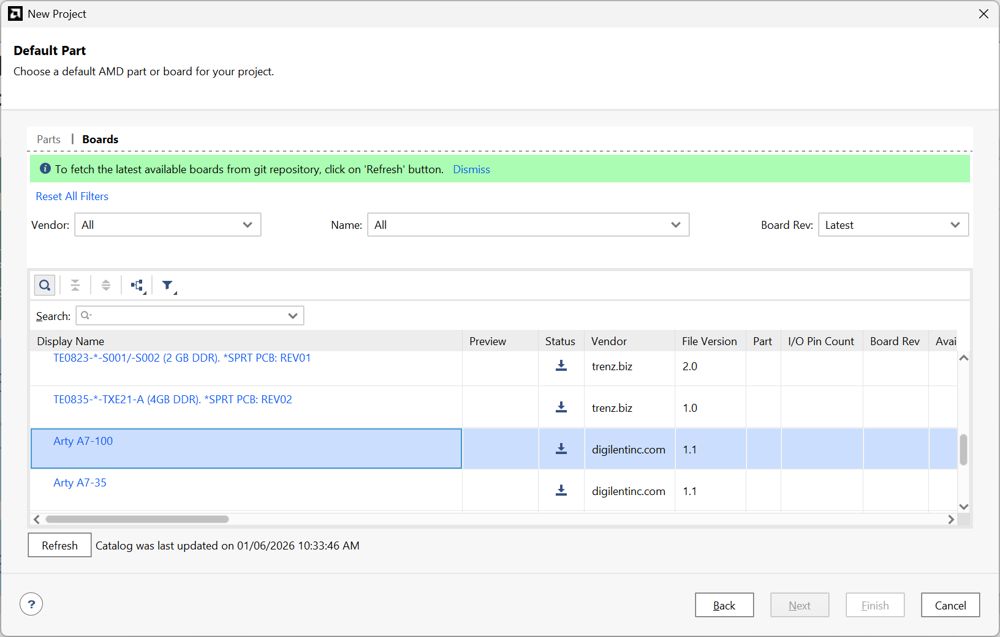
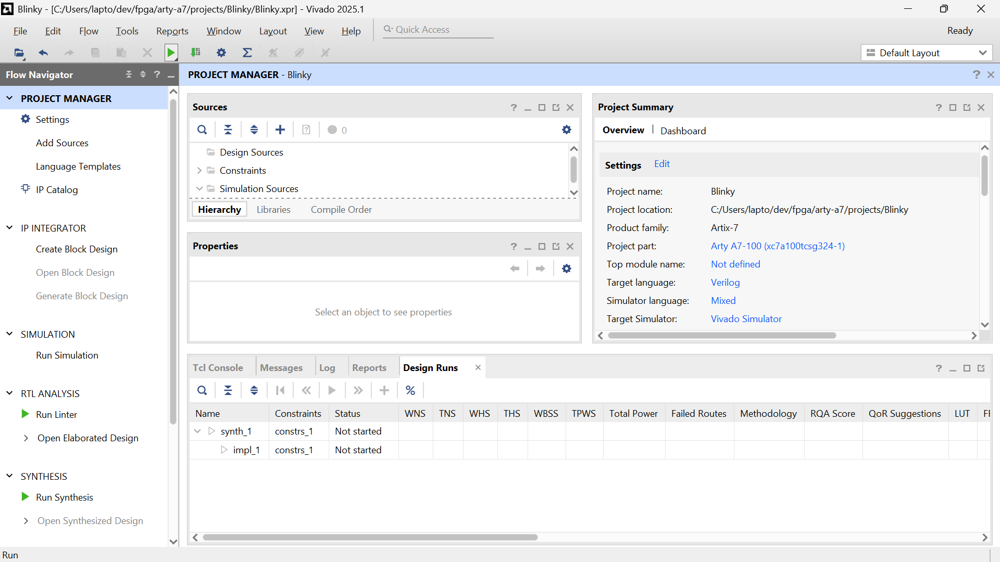
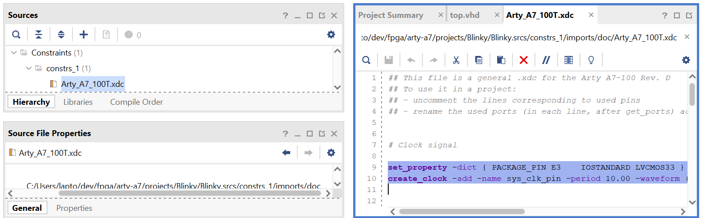
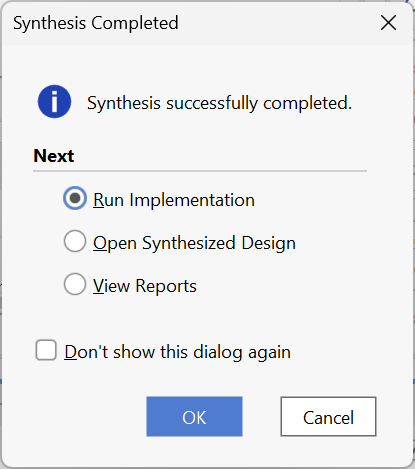
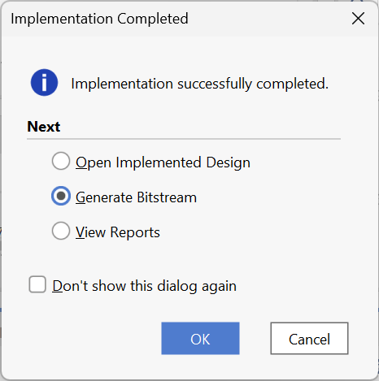
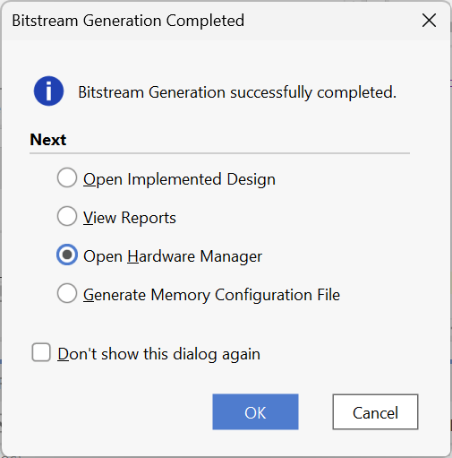
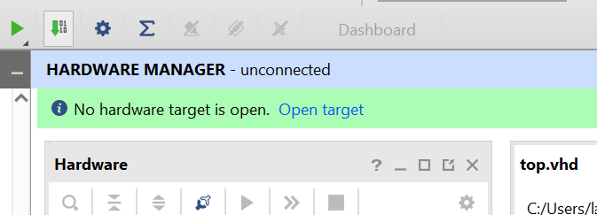
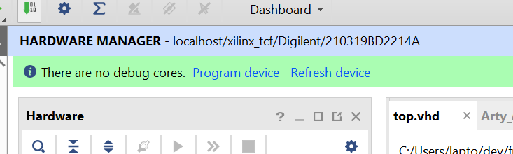

# Arty-A7

This repository contains documentation and sample projects for the Arty-A7 100T.

## Documentation

* Arty A7 Reference Manual (HTML) - https://digilent.com/reference/programmable-logic/arty-a7/reference-manual
* Arty A7 Reference Manual (PDF) - https://mm.digikey.com/Volume0/opasdata/d220001/medias/docus/781/Arty_A7_RM_Web.pdf
* Arty A7 Schematics - https://digilent.com/reference/_media/arty:arty_sch.pdf
* Constraints file: https://github.com/Digilent/Arty-A7-100-XADC/blob/master/src/constraints/Arty_Master.xdc

The documents are stored in the /doc folder of this repository.

## Examples

* vivado/blinky - a LED blinking application

## IDE

As an IDE, Vivado is used. The specific version is Vivado 2025.1 ML Edition.

## Power Supply

Section 3 of the Arty Reference Manual PDF documents the power supply to use.

To power the Arty-A7, via the Power Jack (J13) and an external power supply, the external power supply must provide between 7 and 15 Volt DC.

>  The supply must use a coaxial, center‐positive 2.1mm (or 2.5mm) internal‐diameter plug, and provide a voltage of 7 to 15 Volts DC. The supply should provide a minimum current of 1 amp. Ideally, the supply should be capable of providing 36 Watts of power (12 Volts DC, 3 amps).

I use the power supply which is the Digilent product 240-057: https://www.digikey.de/de/products/detail/digilent-inc/240-057/9445917. The DataSheet of the 240-057 power supply is stored in the /doc folder of this repository.

When attaching the power supply and plugging it in, a green and a red LED turn on and no damage occurs to the board.



# Creating a Project

This section talks about creating a project from scratch in Vivado.

The created project is called 'Blinky' as the goal will be to set up a clock source, divide down the clock to a few hertz and blick an LED using the divided clock.

## Steps

1. Open Vivado 2025.1

2. Create Project > Next > Project name: Blinky > Project location: adjust path here (e.g. C:/Users/lapto/dev/fpga/arty-a7/projects) > Next

3. RTL Project > Check "Do not specify sources at thit time" > Next

4. Change to the "Boards" tab > Read the hint "To fetch the latest available boards from git repository, click on 'Refresh' button > Click the Refresh button. A loading dialog pops up. Wait for about 2 to 3 Minutes. The Dialog will disappear automatically and the list view at the bottom of the wizard is populated with board options to select from. Look for Arty-A7.  The "Next" button is still deactivated. To activate it, download the configuration files from the git repository. In the "Status" Column, there is a download icon which you have to press in order to download the configuration files from the git repository onto you local machine. Once downloaded, with a selected Arty A7-100 row, the "Next" button will be enabled. Click the "Next" button to continue.

As a reminder, Vivado will output this summary:

> A new RTL project named 'Blinky' will be created.

> The default part and product family for the new project:

> Default Board: Arty A7-100
> Default Part: xc7a100tcsg324-1
> Family Artiy-7
> Package: csg324
> Speed Grade: -1

5. Vivado will display the default view



6. Click on "Add Sources" > "Add or create design sources" > Next > "Create File" > File Type: VHDL > File name: "top" > ok > Finish > ok.

7. The top.vhdl file is the top-level entity that contains your complete design. Hardware, such as the hardware-clock and GPIO pins of the Arty A7-100 board will be connected to the top-level design. The top-level design contains of nested entities and can distribute hardware signals that it receives to the ports of the nested entities. For now, the top.vhd file is left as is. After adding constraints we will come back to the top.vhd file and modify it further.

8. Add a .xdc constrainst file. In order to access hardware of the Arty A7-100 board, the hardware has to be given names. Those names can then be used for the ports of VHDL entities. The synthesis toolchain will make sure that the hardware is connected to the entity pins just by comparing the names! A .xdc file is available online from here. https://github.com/Digilent/Arty-A7-100-XADC/blob/master/src/constraints/Arty_Master.xdc. Download the file and store it locally. Then in Vivado > Add Sources > Add or create constraints > Next > Add Files > Select the .xdc file downloaded earlier > Check "Copy constraints file into project" > Finish. Vivado has added the constraints file into the Blinky project.  Looking at the contents of the constraints file, there is a symbol defined which is called "sys_clk_pin". This name, when used an an in-port of a VHDL top-level entity carries the signal of the hardare 100Mhz system clock! We need to work with this system clock to blink the LED. Therefore in the constraints file also enable the constraint that gives access to the LED we want to blink. The Arty A7-100 has eight LEDs (LD0 - LD7) for user experiments. These LEDs are accessible via the array-type constraint LED[0] to LED[7]. We will remember that.

The correct name for the clock pin is: CLK100MHZ. The correct names for the LED are LED.

Here is the port definition:

```
entity top is
    port (
        CLK100MHZ : in std_logic;
        LED : out std_logic_vector(0 to 7)
    );
end top;
```

9. Make the constraints file the target constraints file. In order to solve the problem, use the context menu (Right Mouse Button) in Vivado on the constraints file (.xdc) and selecte "Set as Target Constraint file".

10. Updating the top-level entity further, lets first add input and output ports to access the system clock and the LED-array. Because the 100 Mhz will make the LED blink very fast, the blink will blend into a constantly enable LED because humans cannot see such high frequencies of LED blink.

In order to make the LED blink visible, a different signal is derived from the 100 Mhz clock. For every clock tick of the 100 Mhz clock, a 1 is added to a 32-bit array. Then the LED is connected to bit 27. Since bit 27 does flip quit slowly, the LED blink will be visible.

```
----------------------------------------------------------------------------------
-- Company:
-- Engineer:
--
-- Create Date: 01/06/2026 10:54:40 AM
-- Design Name:
-- Module Name: top - Behavioral
-- Project Name:
-- Target Devices:
-- Tool Versions:
-- Description:
--
-- Dependencies:
--
-- Revision:
-- Revision 0.01 - File Created
-- Additional Comments:
--
----------------------------------------------------------------------------------


library IEEE;
use IEEE.STD_LOGIC_1164.ALL;

library ieee;
use ieee.std_logic_1164.all;
use ieee.numeric_std.all;

-- Uncomment the following library declaration if using
-- arithmetic functions with Signed or Unsigned values
--use IEEE.NUMERIC_STD.ALL;

-- Uncomment the following library declaration if instantiating
-- any Xilinx leaf cells in this code.
--library UNISIM;
--use UNISIM.VComponents.all;

entity top is
    port (
        CLK100MHZ : in std_logic;
        LED : out std_logic_vector(0 to 7)
    );
end top;

architecture Behavioral of top is
    signal slow_clock_counter : std_ulogic_vector(31 downto 0);
    signal slow_clock : std_logic;
    signal mhz100_clock : std_logic;
begin

    slow_clock_process : process (CLK100MHZ)
    begin
        if rising_edge(CLK100MHZ) then
            slow_clock_counter <= std_ulogic_vector(unsigned(slow_clock_counter) + 1);
            slow_clock <= slow_clock_counter(27);
        end if;
    end process slow_clock_process;

    LED(0) <= slow_clock;

end Behavioral;
```

11. Next, go through the sequence that lowers the VHDL code to a bitstream that can be transferred to the FPGA Artyx chip so that it is programmed to execute your VHDL design. The lowering process consists of synthesis, implementation and bitstream generation. Then the hardware manager is used to program the device with the bitstream.







 Vivaso asks if it is allowed to open a hardware server automatically. If the rights are granted to Vivado, Vivado will automatically connect to the Arty A7-100 board.




# Error: Unspecified I/O Standard DEFAULT

```
ERROR: [DRC NSTD-1] Unspecified I/O Standard: 1 out of 9 logical ports use I/O standard (IOSTANDARD) value 'DEFAULT', instead of a user assigned specific value. This may cause I/O contention or incompatibility with the board power or connectivity affecting performance, signal integrity or in extreme cases cause damage to the device or the components to which it is connected. To correct this violation, specify all I/O standards. This design will fail to generate a bitstream unless all logical ports have a user specified I/O standard value defined. To allow bitstream creation with unspecified I/O standard values (not recommended), use this command: set_property SEVERITY {Warning} [get_drc_checks NSTD-1].  NOTE: When using the Vivado Runs infrastructure (e.g. launch_runs Tcl command), add this command to a .tcl file and add that file as a pre-hook for write_bitstream step for the implementation run. Problem ports: sys_clk_pin.
```

```
ERROR: [DRC UCIO-1] Unconstrained Logical Port: 1 out of 9 logical ports have no user assigned specific location constraint (LOC). This may cause I/O contention or incompatibility with the board power or connectivity affecting performance, signal integrity or in extreme cases cause damage to the device or the components to which it is connected. To correct this violation, specify all pin locations. This design will fail to generate a bitstream unless all logical ports have a user specified site LOC constraint defined.  To allow bitstream creation with unspecified pin locations (not recommended), use this command: set_property SEVERITY {Warning} [get_drc_checks UCIO-1].  NOTE: When using the Vivado Runs infrastructure (e.g. launch_runs Tcl command), add this command to a .tcl file and add that file as a pre-hook for write_bitstream step for the implementation run.  Problem ports: sys_clk_pin.
```

Solution: In order to solve the problem, use the context menu (Right Mouse Button) in Vivado on the constraints file (.xdc) and selecte "Set as Target Constraint file".

Solution: You need to use the correct Pin name. The clock is called CLK100MHZ and not sys_clk_pin!


