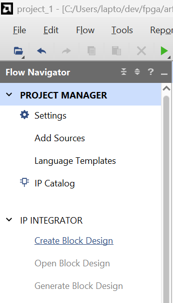
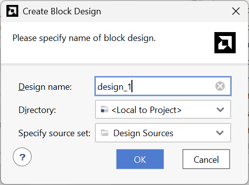
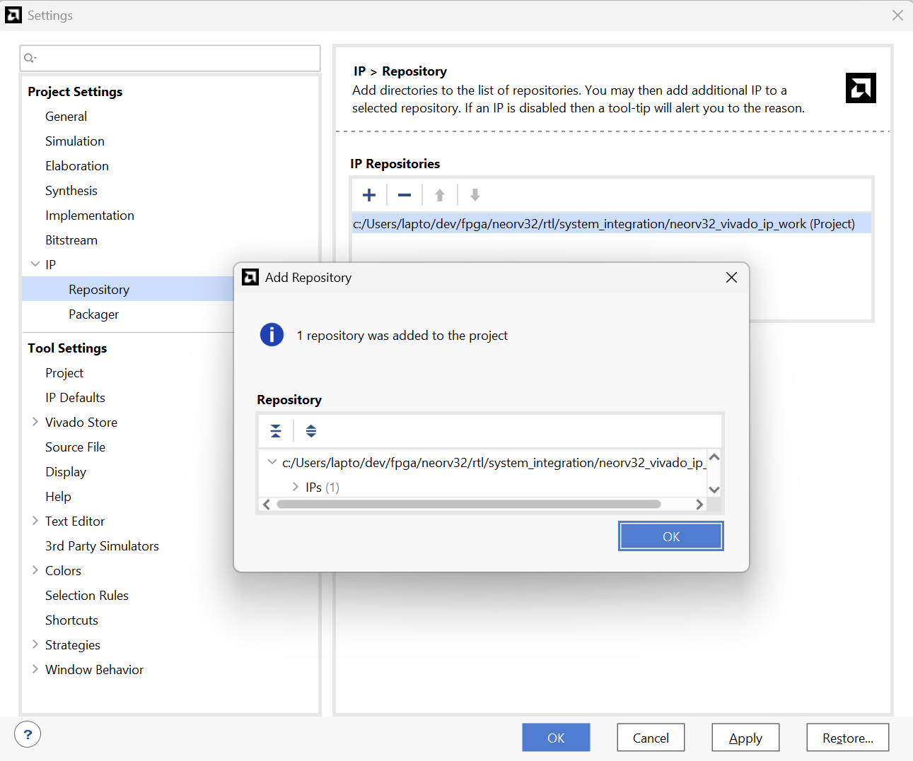
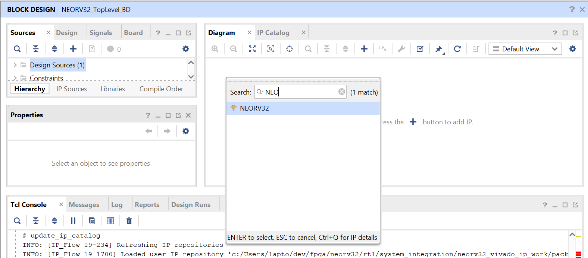
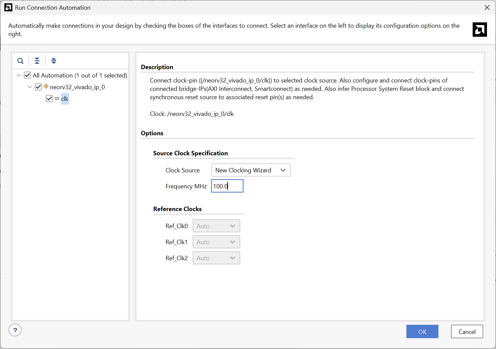

# NEORV32

https://github.com/stnolting/neorv32

https://git.iuma.ulpgc.es:8300/carballo/neorv32-setups

NEORV32 is a RISC-V CPU by Stephan Nolting. It is available on github.

## NEORV32 in Vivado

The NEORV32 documentation contains documentation about vivado.

```
neorv32\docs\userguide\packaging_vivado.adoc
```

The same documentation is available online: https://stnolting.github.io/neorv32/ug/#_packaging_the_processor_as_vivado_ip_block

It seems as if the RISC-V CPU is used as an IP-Block which must be inserted into a block design.

## Using the NEORV32 CPU

https://github.com/stnolting/neorv32/discussions/895

1. Start a new Project in Vivado. Create Project > RTL Project > Do not specify sources at this time. > Next.

2. Switch to the "Boards" Tab > Search for Arty A7-100 > Select Arty A7-100 > In the status column click the download icon if you have not already downloaded the configuration files for the board. > Next > Finish

3. In the Project Manager on the left side of the Vivad IDE, select IP INTEGRATOR > Create Block Design. 

4. A "Create Block Design" Dialog pops up: . Enter a name: "NEORV32_TopLevel_BD". BD stands for BlockDesign. Directory: <Local to Project> > Specify source set: "Design Sources". The official Vivado Documentation for Block Designs is: https://docs.amd.com/r/en-US/ug994-vivado-ip-subsystems/Creating-a-Project

5. Window > Tcl Console to open the Tcl Console. There is a chance that the Tcl Console already has been opened as it is in the default Vivado view configuration. In that case, nothing will change. The Tcl Console is located at the bottom of the screen.

6. git clone https://github.com/stnolting/neorv32.git into a folder on your harddrive.

7. In the Tcl Console navigate to the neorv32/rtl/system_integration folder of the git repository that you have checked out in the last step.

```
cd C:/Users/lapto/dev/fpga/neorv32/rtl/system_integration
```

8. Execute source neorv32_vivado_ip.tcl in the TCL console.

```
source neorv32_vivado_ip.tcl
```

9. A second Vivado instance will open automatically packaging the IP module. After this process is completed, the second Vivado instance will automatically close again.

I am not certain but inside my TCL console, the following output was generated at the end of the process. I assume that this is a success.

```
# set_property ip_repo_paths $outputdir/packaged_ip [current_project]
# update_ip_catalog
INFO: [IP_Flow 19-234] Refreshing IP repositories
INFO: [IP_Flow 19-1700] Loaded user IP repository 'c:/Users/lapto/dev/fpga/neorv32/rtl/system_integration/neorv32_vivado_ip_work/packaged_ip'.
# close_project
```

10. A new folder neorv32_vivado_ip_work is created in neorv32/rtl/system_integration which contains the IP-packaging Vivado project.

11. Open your custom design where you want to integrate the NEORV32 IP module.

12. Click on "Settings" in the "Project Manager" on the left side.

13. Under "Project Settings" expand the "IP" section and click on "Repository".

14. Click the large plus button and select the previously generated IP folder (path/to/neorv32/rtl/system_integration/neorv32_vivado_ip_work/packaged_ip).

15. Click "Select" and close the Settings menu with "Apply" and "OK".



16. You will find the NEORV32 in the "User Repository" section of the Vivado IP catalog.

17. In the BlockDiagram view, use the plus Button to add a new IP Block. Searching for NEORV32, the block should show up.



18. Click on Connection Automation

 This will support you in setting up a 100 Mhz Clock Source for you.

19. Double click the NEORV32 IP block. This will open a dialog that lets you enable or disable features inside the NEORV32 chip. I enabled the I- and D-Caches. Enable UART 1. Enable OpenOCD. Enable the M-Extension for multiplication. Enable I-Mem and D-Mem.

20. The next step is to connect pins to the design sich as Reset, the sys clock, UART RX and TX and the OpenOCD JTAGs.

21. Right Mouse Button > Create Port... >

https://github.com/stnolting/neorv32/discussions/895
