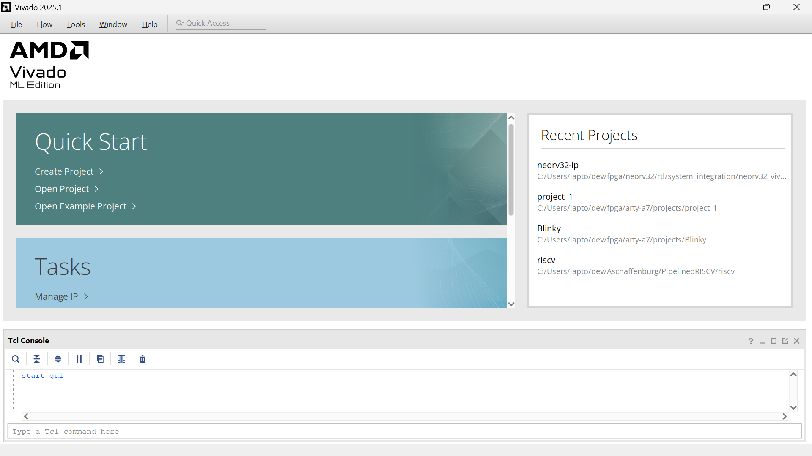

# The NEORV32 Test Setups

https://github.com/stnolting/neorv32-setups

This is a separate repository that you need to clone also in addition to the neorv32 repository.

neorv32-setups repository contains an entire set of VHDL files for the NEORV32 processor inside the folder C:\Users\lapto\dev\VHDL\neorv32-setups\neorv32\rtl

The way the neorv32\rtl folder is inserted into the neorv32-setups repository is via git subprojects.

Opening a bash inside the folder neorv32-setups allows you to enter git commands directly. You can use any command line or bash you like as long as it allows you to execute git commands.

In my case I installed the fork git-client (https://git-fork.com/) and opened the neorv32-setups folder inside fork (File > Open Repository). Once the repository is opened inside fork, you can use the console button on the top right to open a bash inside the neorv32-setups repository.

```
git submodule
```

will list the subprojects.

```
$ git submodule
 cd6ebf23edb1209c98b7d88b7167a4707e5372ef constraints (heads/main)
 b170a8d3e0762ebab97f56b8bd6cef03f2033378 neorv32 (v1.12.6-65-gb170a8d3)
```

The large hex number is the SHA of the git commit and identifies a commit. Often only the first seven digits are used since the number is too large. When looking for b170a8d on https://github.com/stnolting/neorv32/commits/main/ it is in fact the latest commit of the NEORV32 repository that is used inside the neorv32-setups repository.

Now, if you have made changes to the NEORV32 CPU and you want to build a bitstream inside Vivado, you need to commit your changes to the NEORV32 CPU to some repository that you own and then point the subproject of the neorv32-setups repository to that repository.

One important piece of information is required! In order to change a submodule in a repository, you have to commit to that repository. Unless you commit, the remote repository will not change! This means that since the original neorv32-setups repository is owned by stnolting, you will not be able to change the subproject inside that repository. This is the reason why the first step is to commit the neorv32-setups into a git repository that you own. You can use the fork feature to create a copy of the repository in one of your own github accounts.

Say, all your changes are contained inside https://github.com/WolfgangBischoffTHAB/NEORV32_MatrixExtension.

To change the URL to the subproject via git commands, navigate into the subproject's folder

```
cd neorv32-setups/neorv32
```

and execute:

```
git remote set-url origin <new-remote-url>  # Set the new remote URL
```

e.g.

```
git remote set-url origin https://github.com/WolfgangBischoffTHAB/NEORV32_MatrixExtension.git
```

Then check if the change worked:

```
git remote -v
```

This command should list the new remote URL.

Now commit all changes

```
cd neorv32-setups
git add *
git commit -m "changed remote NEORV32 RTL project"
git push
```

In order to change the subproject manually by editing files, edit the file neorv32-setups\.gitmodules and change the section for the neorv32 submodule from

```
[submodule "neorv32"]
	path = neorv32
	url = https://github.com/stnolting/neorv32
	ignore = dirty
```

to

```
[submodule "neorv32"]
	path = neorv32
	url = https://github.com/WolfgangBischoffTHAB/NEORV32_MatrixExtension
	ignore = dirty
```

Also edit the file neorv32-setups\.git\config and also update

```
[submodule "neorv32"]
	url = https://github.com/stnolting/neorv32
```

to

```
[submodule "neorv32"]
	url = https://github.com/WolfgangBischoffTHAB/NEORV32_MatrixExtension
```


https://github.com/stnolting/neorv32-setups/blob/main/vivado/arty-a7-test-setup/create_project.tcl

This homepage lists projects that use the NEORV32 processor in Vivado.

The git repository once checked out, does not contain Vivado projects (.xpr) but it contains .tcl files that need to be executed in order to generate Vivado projects (.xpr). The .tcl files are executed using the TCL console build into Vivado.

When opening Vivado, there is an option at the bottom of the screen to immediately open the TCL Console.



```
cd C:/Users/lapto/dev/fpga/neorv32-setups/vivado/arty-a7-test-setup
source create_project.tcl
```

```
cd C:/Users/lapto/dev/VHDL/neorv32-setups/vivado/arty-a7-100T-test-setup
source create_project.tcl
```

Error:

```
ERROR: [Board 49-71] The board_part definition was not found for digilentinc.com:arty-a7-35:part0:1.0. The project's board_part property was not set, but the project's part property was set to xc7a35ticsg324-1L. Valid board_part values can be retrieved with the 'get_board_parts' Tcl command. Check if board.repoPaths parameter is set and the board_part is installed from the tcl app store.
```

Tools > Vivado Store > On the top, select the "Boards" Tab > Search for "Arty" > Select Arty A7-35 since the tcl script is created for this board. > Click the install button (= Download Button = Arrow from top down onto a horizontal line). > Close.

Also modify create_project.tcl and add this change:

```
set_property board_part digilentinc.com:${board}:part0:1.1 [current_project]
```

You see that the 1.0 version has been changed to the 1.1 version. This works for Vivado 2025.1.

Run ```source create_project.tcl``` again

This time the Tcl Script succeeds and it generates a new folder called work.

Inside the work folder there is a full-fledged Vivado project (arty-a7-35-test-setup.xpr).